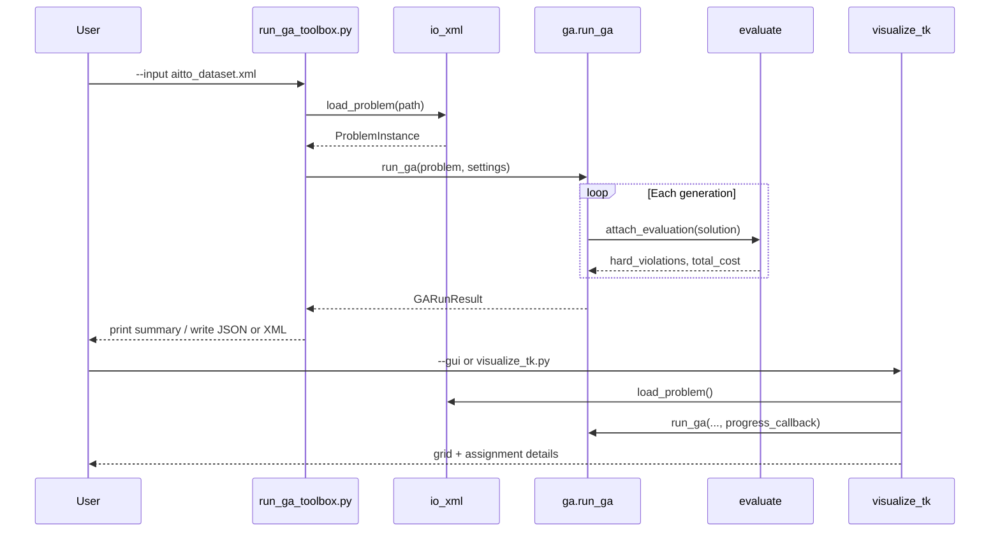

# Python GA Timetable Toolbox — Build Methods

This document describes **how the toolbox is built**: module layout, data flow,
implementation steps, and how to run or extend it. For goals and scope, see
[GA_TOOLBOX_PLAN.md](GA_TOOLBOX_PLAN.md).

## Prerequisites

- **Python 3** with Tkinter (included with standard Windows Python installs).
- Generated dataset:
  `dataset/itc2019/aitto_dataset.xml` (from
  `scripts/convert_dataset_to_itc2019.py`).
- **PowerShell** working directory: repository root `aiTTO/`.

No extra pip packages are required for the prototype.

## Repository layout

```text
aiTTO/
├── aitto_toolbox/
│   ├── __init__.py          # Public exports for LLM/tool imports
│   ├── model.py             # Dataclasses: ProblemInstance, solutions, GA settings
│   ├── io_xml.py            # load_problem(), solution export
│   ├── evaluate.py          # evaluate_solution(), attach_evaluation()
│   ├── ga.py                # GA operators and run_ga()
│   └── visualize_tk.py      # TimetableToolboxApp (Tkinter)
├── scripts/
│   └── run_ga_toolbox.py    # CLI and --gui launcher
├── dataset/itc2019/
│   └── aitto_dataset.xml    # Default problem instance
├── GA_TOOLBOX_PLAN.md       # Plan summary
└── GA_TOOLBOX_BUILD.md      # This file
```

## Build pipeline (data flow)



## Module build methods

### 1. `model.py` — domain objects

Define frozen dataclasses for everything the GA needs:

- `Room`, `UnavailablePeriod`, `RoomOption`, `TimeOption`
- `ClassSection`, `Course`, `Student`, `DistributionConstraint`
- `ProblemInstance` — aggregate with lookup dicts by id
- `ClassAssignment`, `TimetableSolution` — chromosome and scored solution
- `GASettings`, `GAHistoryEntry`, `GARunResult` — run configuration and output
- `slot_to_time()` — convert slot index to `HH:MM` for display

**Design choice:** keep the model smaller than full ITC 2019; only fields used
by parse, evaluate, and GA are stored.

### 2. `io_xml.py` — parse and export

**`load_problem(path)`**

1. Parse root `<problem>` attributes: `nrDays`, `nrWeeks`, `slotsPerDay`, name.
2. Read `<optimization>` weights.
3. Build `rooms` from `<rooms><room>` and nested `<unavailable>`.
4. Walk `<courses><course>…<class>` — collect room/time domains per class.
5. Build `students` from `<students><student><course>`.
6. Build `distributions` from `<distributions><distribution>`.
7. Load `dataset/hardconstraints.xlsx` and `dataset/softconstraints.xlsx` as
   constraint catalog rows when they are available.
8. Return `ProblemInstance` with `source_path` set.

**Export**

- `write_solution_json()` — human-readable JSON for tools and debugging.
- `write_solution_xml()` — compact ITC-style solution with class times, rooms,
  and student ids matched by cohort prefix in `externalId`.

### 3. `evaluate.py` — scoring

**`evaluate_solution(problem, solution)`**

1. For each class, validate assignment exists and indices are in domain.
2. Add XML **time_penalty** and **room_penalty** (weighted).
3. **Hard:** capacity, room unavailability overlap, room double-booking.
4. **Hard:** same-cohort time overlap (proxy for student clash in this dataset).
5. **Hard:** missing, extra, and incorrect allocations based on each synthetic
   student's required courses and cohort prefix.
6. **Soft/hard:** `NotOverlap` distributions between listed class pairs.
7. **Soft:** single-course day penalty when a cohort has exactly one class
   meeting on a day.
8. Return `EvaluationResult` with `hard_violations`, `total_cost`, `breakdown`.

The hard and soft workbook files are currently descriptive catalogs rather than
per-student preference tables. The toolbox therefore maps each catalog row to
the closest available prototype check:

| Workbook rule | Current fitness handling |
|---------------|--------------------------|
| Clashes | Hard `cohort_overlap` for same-cohort class overlaps |
| Missing allocations | Hard `missing_allocation` per student/course |
| Extra allocations | Hard `extra_allocation` when more than one class is assigned per student/course |
| Incorrect allocations | Hard `incorrect_allocation` when a cohort class is for a course not taken by the student |
| One course per room/time | Hard `room_overlap` |
| Room capacity | Hard `room_capacity` |
| Day preferences | Existing XML `time_penalty` approximates compiled preferences |
| Time period preferences | Existing XML `time_penalty` approximates compiled preferences |
| Single course during a day | Soft `single_course_day_penalty` |

Helper functions: `bitstrings_overlap`, `intervals_overlap`, `times_overlap`.

**`attach_evaluation()`** — writes scores onto `TimetableSolution` for GA use.

### 4. `ga.py` — genetic algorithm toolbox

| Function | Role |
|----------|------|
| `random_solution()` | Pick random time index and room id per class |
| `repair_solution()` | Fix missing/invalid genes from domains |
| `tournament_select()` | Choose parent by mini-tournament on fitness |
| `crossover()` | Uniform mix of class genes from two parents |
| `mutate()` | Per-class random time/room change at `mutation_rate` |
| `evaluate_population()` | Score entire population |
| `run_ga()` | Main loop with elitism and optional `progress_callback` |

**`run_ga()` loop**

1. Seed RNG from `GASettings.seed`.
2. Create population; repair; evaluate.
3. For each generation: sort by fitness, copy elite, fill rest with
   select → crossover → mutate → repair → evaluate.
4. Track global best; append `GAHistoryEntry` each generation.
5. Return `GARunResult(best_solution, history)`.

Default settings (in `GASettings`): population 50, generations 100, mutation
0.15, crossover 0.85, tournament 4, elitism 2, seed 1.

### 5. `visualize_tk.py` — Tkinter app

**`TimetableToolboxApp`**

- **Summary tab** — counts and cohort list from loaded problem.
- **Run GA tab** — population, generations, mutation, seed; progress listbox;
  best-solution text (breakdown + assignments).
- **Visualize tab** — room combobox; canvas grid (days × slots); rectangles
  for classes assigned to the selected room or cohort. The canvas is scrollable
  and initially focuses on the normal teaching window, `08:30` to `17:30`.

Load default path from `DEFAULT_DATASET_XML`. GA runs on main thread with
`update_idletasks()` for progress updates (prototype simplicity).

### 6. `scripts/run_ga_toolbox.py` — entry point

- Inserts repo root on `sys.path` so `aitto_toolbox` imports work when invoked
  as `python .\scripts\run_ga_toolbox.py`.
- **`--gui`** → `TimetableToolboxApp`.
- Otherwise → `load_problem` → `run_ga` → print summary; optional
  `--json-output` / `--xml-output`.

## How to build and run

### Step 1 — Generate or refresh the XML dataset

```powershell
python .\scripts\convert_dataset_to_itc2019.py --gui
```

Assign module sets to cohorts (not `None`), then generate
`dataset\itc2019\aitto_dataset.xml`.

### Step 2 — Verify parser

```powershell
python -c "from aitto_toolbox import load_problem; p=load_problem('dataset/itc2019/aitto_dataset.xml'); print(len(p.classes), len(p.students))"
```

### Step 3 — Run GA from CLI

```powershell
python .\scripts\run_ga_toolbox.py `
  --input .\dataset\itc2019\aitto_dataset.xml `
  --population 50 `
  --generations 100 `
  --seed 1
```

### Step 4 — Open GUI

```powershell
python .\scripts\run_ga_toolbox.py --gui
```

### Step 5 — Export solution (optional)

```powershell
python .\scripts\run_ga_toolbox.py `
  --generations 100 `
  --json-output .\dataset\itc2019\ga_solution.json `
  --xml-output .\dataset\itc2019\ga_solution.xml
```

## Validation checklist

After code changes:

1. `python -m compileall aitto_toolbox scripts\run_ga_toolbox.py`
2. Parser smoke test (class/student counts).
3. Short GA run (`--generations 3 --population 8 --seed 1`).
4. GUI import/instantiate: `TimetableToolboxApp()` loads and destroys cleanly.
5. Linter pass on `aitto_toolbox/` and `scripts/run_ga_toolbox.py`.

## Extending the toolbox

| Extension | Suggested approach |
|-----------|-------------------|
| Better feasibility | Smarter init/heuristic repair in `ga.py` |
| Official ITC scoring | New module `evaluate_itc.py`; swap in `run_ga` |
| Student sectioning | Add genes per student; extend `evaluate.py` |
| Teacher constraints | Parse from future XML; add hard checks in evaluator |
| LLM tools | Wrap `load_problem`, `run_ga`, exports as functions with typed returns |
| Faster search | Optional `multiprocessing` in `evaluate_population` |

Keep public imports stable in `aitto_toolbox/__init__.py` so agents depend on
a small API surface.

## LLM integration pattern

```python
from aitto_toolbox import GASettings, load_problem, run_ga
from aitto_toolbox.io_xml import write_solution_json

problem = load_problem("dataset/itc2019/aitto_dataset.xml")
result = run_ga(problem, GASettings(generations=50, seed=1))
write_solution_json(problem, result.best_solution, "dataset/itc2019/ga_solution.json")

report = {
    "feasible": result.best_solution.hard_violations == 0,
    "hard_violations": result.best_solution.hard_violations,
    "total_cost": result.best_solution.total_cost,
    "breakdown": result.best_solution.breakdown,
}
```

## Known prototype limits

- Short GA runs may still show many hard violations; increase generations or
  improve init/repair for better timetables.
- Cohort overlap detection is a **proxy** for student conflicts, not full ITC
  student criterion.
- GUI runs GA synchronously; long runs block the window.
- Solution XML student assignment uses cohort prefix matching, not full
  sectioning logic.

These limits are acceptable for the prototype; address them when moving toward
`BLUEPRINT.md` milestones M2–M3.
