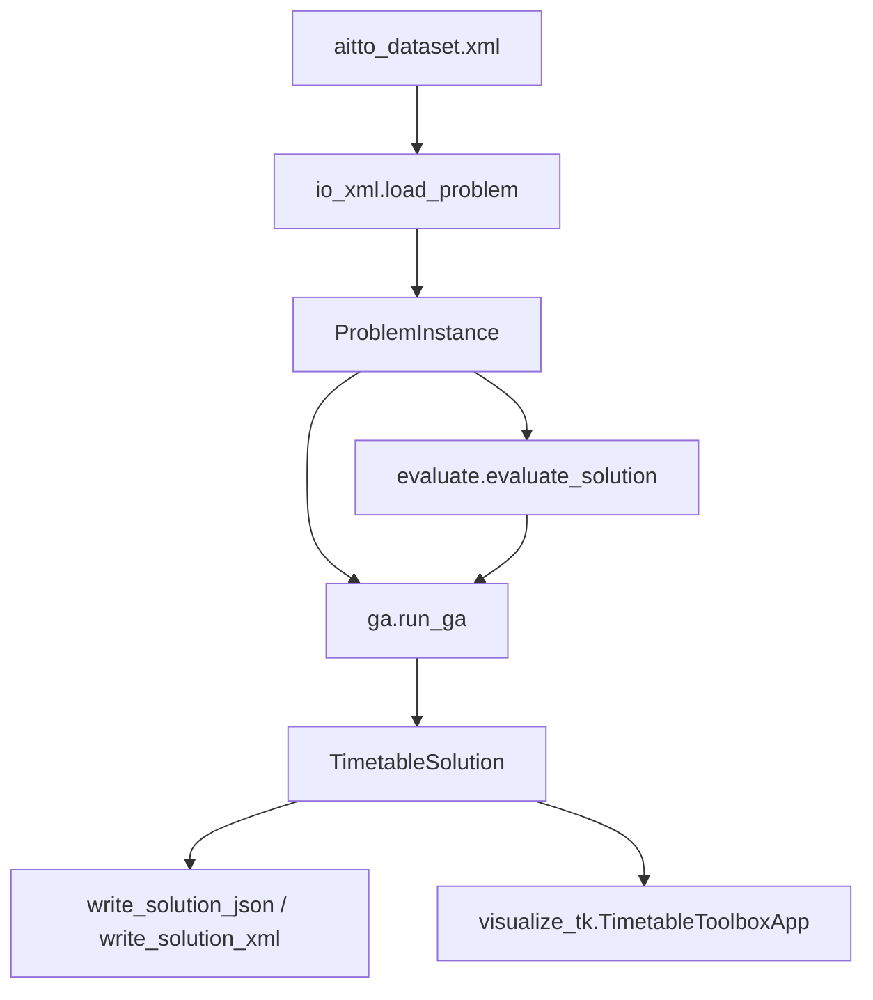

# Python GA Timetable Toolbox — Plan

This document summarizes the prototype plan for the aiTTO Python genetic-algorithm
toolbox. It describes what to build, why, and what is intentionally left out.
For implementation details and run instructions, see
[GA_TOOLBOX_BUILD.md](GA_TOOLBOX_BUILD.md).

## Goal

Build a **simple Python prototype** that:

1. Reads the generated timetable dataset from
   `dataset/itc2019/aitto_dataset.xml`.
2. Runs a **genetic algorithm** to assign **times** and **rooms** to class
   sections.
3. **Visualizes** the dataset and best solution in a **Tkinter** desktop app.
4. Exposes reusable functions so an **LLM can call the GA as a toolbox** later.

This is **not** the full Java/ScholORs solver described in `BLUEPRINT.md`. The
blueprint remains the long-term target; this plan covers a lightweight Python
path for experimentation and demonstration.

## Scope

### In scope

- Parse aiTTO XML into compact Python dataclasses.
- One chromosome gene per class: time option index + room id.
- Baseline GA: init, selection, crossover, mutation, repair, elitism.
- Transparent evaluator: hard violations + weighted soft cost breakdown.
- CLI runner and Tkinter viewer (standard library only).
- JSON and XML solution export for downstream tools.

### Out of scope (for this prototype)

- Full ITC 2019 official scoring and all 17 distribution constraint types.
- ScholORs/Java integration and GPL-derived code reuse.
- Complete student sectioning (parent-child subparts, config choice).
- Teacher-load constraints (not yet in the XML dataset).
- Island model, local search, and preference compilation from Mahlous/IPGALS.
- Production UI, web dashboard, or cloud deployment.

## Data source

| Item | Value |
|------|--------|
| Default input | `dataset/itc2019/aitto_dataset.xml` |
| Format | ITC 2019-style XML (aiTTO variant) |
| Slot model | **30-minute slots** (`slotsPerDay=48`) |
| Calendar | 7 days, up to 53 weeks (from academic calendar) |
| Classes | One section per active cohort/module pair |
| Students | Synthetic students per cohort (from converter) |

The converter (`scripts/convert_dataset_to_itc2019.py`) produces this XML from
Excel workbooks. Cohorts assigned `None` are omitted from the XML to keep the
problem smaller.

## Architecture



## Problem representation

### Inputs (from XML)

- **Rooms** — id, name, capacity, type, unavailable periods.
- **Courses/modules** — id, code, title, class sections.
- **Classes** — allowed room options (with penalties), allowed time options
  (days, start, length, weeks, penalties), cohort label, capacity limit.
- **Students** — required course ids (sectioning kept simple).
- **Distributions** — soft `NotOverlap` between sections of the same module.
- **Weights** — time, room, distribution, student penalty weights.

### Chromosome

Each solution maps every class id to:

```text
ClassAssignment(time_index, room_id)
```

`time_index` selects one row from that class's `<time>` domain in the XML.
`room_id` must appear in that class's `<room>` domain.

Student enrollment is **not** evolved in the prototype: the dataset already
defines one section per cohort/module, and students stay on their required
courses.

## Genetic algorithm (planned behaviour)

1. **Initialize** — random valid time and room per class.
2. **Evaluate** — count hard violations; sum weighted soft penalties.
3. **Repeat** for N generations:
   - Keep top solutions (elitism).
   - Tournament selection of parents.
   - Uniform crossover over class genes.
   - Mutation: change time and/or room within domains.
   - Repair invalid or missing genes.
   - Re-evaluate population; track global best.
4. **Return** best solution and generation history.

### Fitness

```text
fitness = hard_violations × 1,000,000 + total_cost
```

Feasibility first, then cost minimization.

## Evaluator (planned checks)

| Category | Check |
|----------|--------|
| Hard | Missing assignment, invalid time/room index |
| Hard | Room capacity below class limit |
| Hard | Class scheduled during room unavailability |
| Hard | Two classes overlap in the same room |
| Hard | Two classes overlap for the same cohort |
| Soft | Time and room option penalties from XML |
| Soft | Soft `NotOverlap` distribution penalties |
| Soft | Single-course day penalty from `softconstraints.xlsx` |

The toolbox also reads `dataset/hardconstraints.xlsx` and
`dataset/softconstraints.xlsx` as constraint catalogs. The current evaluator
supports the listed hard rows directly where the prototype model has enough
data. Day and time-period preferences are treated as already compiled into XML
time penalties until a structured student-preference workbook is added.

## User interfaces

### Command line

```powershell
python .\scripts\run_ga_toolbox.py `
  --input .\dataset\itc2019\aitto_dataset.xml `
  --population 50 `
  --generations 100 `
  --mutation-rate 0.15 `
  --seed 1
```

### Tkinter GUI

```powershell
python .\scripts\run_ga_toolbox.py --gui
```

Planned GUI features:

- Dataset summary (rooms, courses, classes, students, slots).
- GA parameters and Run button.
- Progress log (generation, hard violations, cost).
- Room or cohort timetable grid (day × slot).
- Scrollable timeline that opens at the normal `08:30` to `17:30` teaching window.
- Best-solution assignment list with times and penalties.

## LLM toolbox (future use)

The plan treats the GA as callable Python tools:

```python
from aitto_toolbox import GASettings, load_problem, run_ga

problem = load_problem("dataset/itc2019/aitto_dataset.xml")
result = run_ga(problem, GASettings(population_size=50, generations=100, seed=1))
best = result.best_solution
```

Agents should read `best.hard_violations`, `best.total_cost`, `best.breakdown`,
and `best.assignments` without opening the GUI.

## Deliverables

| Deliverable | Path |
|-------------|------|
| Package | `aitto_toolbox/` |
| CLI entry | `scripts/run_ga_toolbox.py` |
| Plan doc | `GA_TOOLBOX_PLAN.md` (this file) |
| Build doc | `GA_TOOLBOX_BUILD.md` |

## Relationship to `BLUEPRINT.md`

| Blueprint (long term) | This prototype |
|----------------------|----------------|
| ScholORs Java foundation | Pure Python, no GPL dependency |
| Full ITC 2019 DTF + cost | Simplified transparent evaluator |
| Hybrid GA + LS + islands | Single-population baseline GA |
| Student sectioning in chromosome | Fixed section per cohort/module |
| School UI + preference compiler | Tkinter toolbox + XML in/out |

When the prototype is stable, operators and evaluators from the blueprint
(Mahlous student crossover, IPGALS repair, official ITC scoring) can be added
incrementally behind the same `load_problem` / `run_ga` interface.

## Important notices

- ITC 2019 is a **reference format**, not a strict compliance target for v1.
- **30-minute slots** reduce search space versus ITC's 5-minute slots.
- **Teacher load** is not modeled until encoded in the problem XML.
- The evaluator favours **explainability** over competition completeness.
- Runs on **Windows PowerShell** with Python 3 and Tkinter (stdlib).
